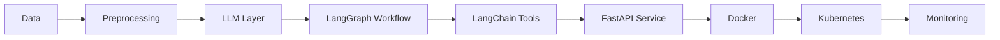

<!-- ====================== RAVISH | AI SYSTEMS ====================== -->

 

---

## ▌ INTELLIGENCE ARCHITECTURE

Data → LLM → Agent Orchestration → API → Containers → Cluster → Monitoring  

Production-grade systems.  
Scalable. Structured. Reliable.

---

## ▌ AGENTIC FLOW

---

## ▌ ENGINEERING STACK

  
  
  
  

---

## ▌ PERFORMANCE SIGNALS

  
  

---

## ▌ ENGINEERING BELIEF

Architecture defines intelligence.  
Infrastructure defines reliability.  
Scale defines impact.

---

