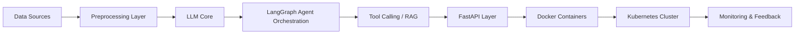

<!-- ====================== RAVISH AI LAB ====================== -->

 

---

## ▌ INTELLIGENCE ARCHITECTURE

I design and deploy production-grade AI systems.

Stack focus:
Data → LLM Reasoning → Agent Workflows → API Layer → Scalable Deployment → Monitoring.

No prototypes.  
Only engineered systems.

---

## ▌ AGENTIC FLOW DESIGN

---

## ▌ ENGINEERING STACK

  

---

## ▌ PERFORMANCE SIGNALS

  
  

---

## ▌ CURRENT DIRECTION

• Advanced LangChain Architectures  
• LangGraph Multi-Agent Systems  
• Oracle-Backed Enterprise AI  
• Distributed Deployment (Docker + Kubernetes)  
• LLM Fine-Tuning  

---

## ▌ ENGINEERING BELIEF

Architecture defines intelligence.  
Deployment defines value.  
Scale defines success.

---

