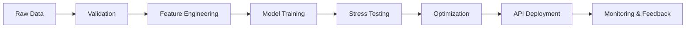

<!-- ======================= RAVISH | AI SYSTEMS ======================= -->

 

  

---

## ▌ INTELLIGENCE ARCHITECTURE

I design artificial intelligence systems that move beyond experimentation.

From raw data to monitored production pipelines,  
my work focuses on reliability, scalability, and structural clarity.

AI is not about models.

AI is about systems that survive scale.

---

## ▌ SYSTEM THINKING

---

## ▌ ENGINEERING FOUNDATION

  

---

## ▌ PRODUCTION METRICS

  
  

---

## ▌ CURRENT FOCUS

• Large Language Model Fine-Tuning  
• Agentic AI Architectures  
• Scalable ML Infrastructure  
• Intelligent System Design  

---

## ▌ ENGINEERING BELIEF

Structured reasoning at scale defines intelligence.

Most engineers train models.

Few design systems.

I design systems.

---

