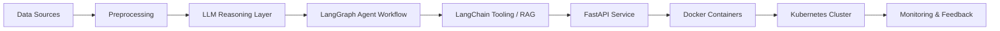

<!-- ====================== RAVISH | AI SYSTEMS LAB ====================== -->

 

---

## ▌ INTELLIGENCE ARCHITECTURE

Production-ready AI systems.

Data → LLM → Agent Orchestration → API Layer → Containerization → Cluster Deployment → Monitoring.

No prototypes.  
Only scalable architecture.

---

## ▌ AGENTIC SYSTEM FLOW

---

## ▌ ENGINEERING STACK

### Core Programming

  

---

### AI & Agent Frameworks

  
  

---

### Database Layer

  

Oracle SQL • Enterprise Data Systems

---

### Deployment & Infrastructure

  

---

## ▌ PERFORMANCE SIGNALS

  
  

---

## ▌ CURRENT DIRECTION

• Multi-Agent Systems using LangGraph  
• Enterprise LLM Architectures  
• Oracle-Backed Scalable AI  
• Kubernetes Production Deployments  

---

## ▌ ENGINEERING BELIEF

Architecture defines intelligence.  
Infrastructure defines reliability.  
Scale defines impact.

---

